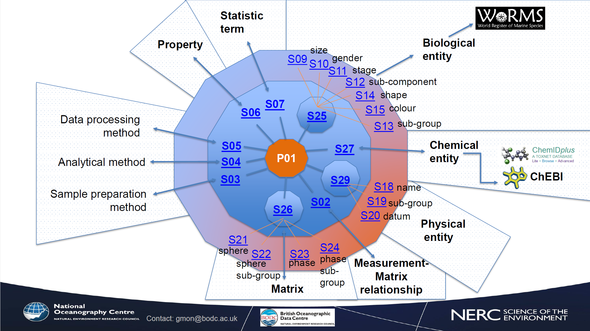

# Parameter Usage Vocabulary Ontology
An ontology for defining parameters (observable-properties) corresponding to the [NVS Parameter Usage Vocabulary (P01)](https://vocab.nerc.ac.uk/collection/P01/current/). PUV Ontology is formally documented at the **ontology namespace** https://w3id.org/env/puv 

## P01 Semantic Model
The 'semantic model' for parameters is described in the [P01 issue tracker](https://github.com/nvs-vocabs/P01/blob/master/README.md) and summarized in the following figure: 



The P01 'Semantic Model' defines a rule to build a Parameter Name (seen as its `skos:prefLabel`). 
However, the current RDF representation from NVS only shows generalized SKOS relationships to the component terms (`skos:broader` and `skos:related`). 
For example, the description of parameter [`R0186569`](http://vocab.nerc.ac.uk/collection/P01/current/R0186569/) is as follows:

```Turtle
<http://vocab.nerc.ac.uk/collection/P01/current/R0186569/> a skos:Concept ;
    skos:altLabel "DryWt_CAS57117-41-6_BE006569" ;
    skos:broader <http://vocab.nerc.ac.uk/collection/P02/current/BCOC/>,
        <http://vocab.nerc.ac.uk/collection/S06/current/S0600045/>,
        <http://vocab.nerc.ac.uk/collection/S25/current/BE006569/>,
        <http://vocab.nerc.ac.uk/collection/S26/current/MAT01963/>,
        <http://vocab.nerc.ac.uk/collection/S27/current/CS003687/> ;
    skos:definition "The amount (mass or number of moles) of the specified analyte per unit weight of the specified organism or part thereof after water has been removed."@en ;
    skos:prefLabel "Concentration of 1,2,3,7,8-pentachlorodibenzofuran {1,2,3,7,8-pentaCDF CAS 57117-41-6} per unit dry weight of biota {Mytilus galloprovincialis (ITIS: 79456: WoRMS 140481) [Subcomponent: flesh]}"@en ;
    skos:related <http://vocab.nerc.ac.uk/collection/P06/current/UUKG/>,
        <http://vocab.nerc.ac.uk/collection/S02/current/S041/> .
```

## PUV Ontology
Using PUV-ont the relationships in the same example are encoded as follows:

```turtle
<http://vocab.nerc.ac.uk/collection/P01/current/R0186569/> a skos:Concept , puv:Parameter ;
  skos:altLabel "DryWt_CAS57117-41-6_BE006569" ;
  skos:broader <http://vocab.nerc.ac.uk/collection/P02/current/BCOC/> ;
  skos:definition "The amount (mass or number of moles) of the specified analyte per unit weight of the specified organism or part thereof after water has been removed."@en ;
  skos:prefLabel "Concentration of 1,2,3,7,8-pentachlorodibenzofuran {1,2,3,7,8-pentaCDF CAS 57117-41-6} per unit dry weight of biota {Mytilus galloprovincialis (ITIS: 79456: WoRMS 140481) [Subcomponent: flesh]}"@en ;
  puv:biologicalObject <http://vocab.nerc.ac.uk/collection/S25/current/BE006569/> ;
  puv:chemicalObject <http://vocab.nerc.ac.uk/collection/S27/current/CS003687/> ;
  puv:matrixRelationship <http://vocab.nerc.ac.uk/collection/S02/current/S041/> ;
  puv:matrix <http://vocab.nerc.ac.uk/collection/S26/current/MAT01963/> ;
  puv:property <http://vocab.nerc.ac.uk/collection/S06/current/S0600045/> ;
  puv:uom <http://vocab.nerc.ac.uk/collection/P06/current/UUKG/> ;
.
```
This follows an OWL implementation defined in [PUV-ont](rdf/puv.ttl) which specifies explicit links to the dependency terms from different vocabularies.  


## Other considerations
### Units of measure
Note that the Semantic Model does **not** include units-of-measure. 

A parameter _could_ be linked to a unit-of-measure using [qudt:applicableUnit](http://qudt.org/schema/qudt/applicableUnit)

### Parameter dimensionality
A parameter may be linked to a dimension vector using [qudt:hasDimensionVector](http://qudt.org/schema/qudt/hasDimensionVector) 

## Prior work
The [Complex Property Model in OWL](https://github.com/adamml/opm-owl) developed by [Adam Leadbetter](https://github.com/adamml) also addressed this issue. 
See our [comparison of PUV-ont with CPM ontology](puv-vs-cpm.md)
