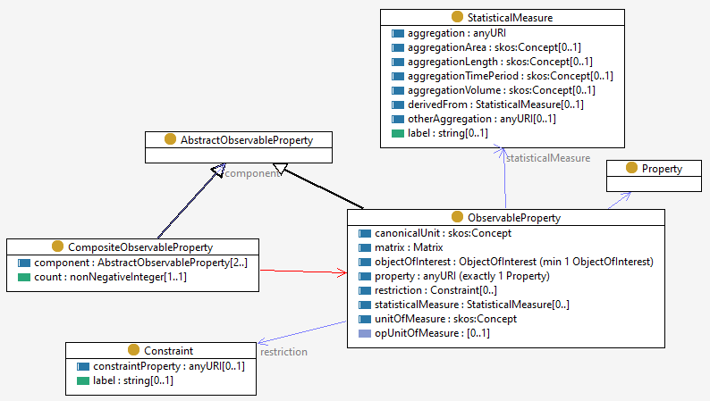

# Compare PUV-ont with CPM ontology

[Parameter Usage Vocabulary Ontology](https://github.com/CSIRO-enviro-informatics/PUV-ont) builds on the [Semantic Sensor Network Ontology](https://www.w3.org/TR/vocab-ssn/)

 

[Complex Property Model in OWL](https://github.com/adamml/opm-owl) is formally standalone, though it is influenced by earlier work on [OGC Observatiosn and Measurements](https://www.ogc.org/standards/om) and elaborations such as the [Observable-Properties ontology](http://registry2.it.csiro.au/def/op)

 

